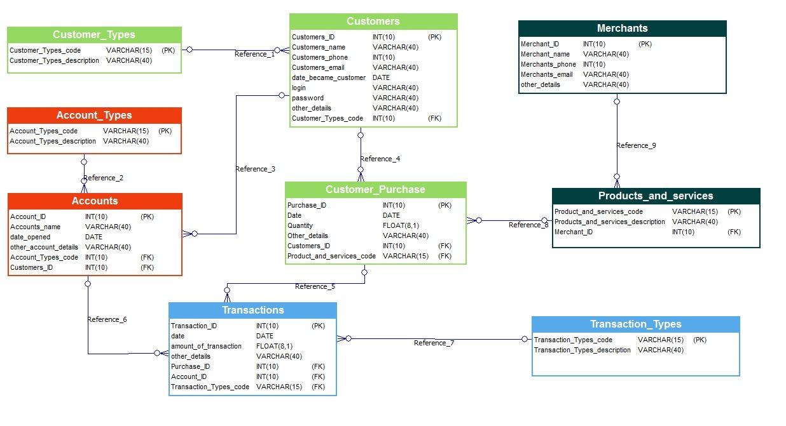

# BankSysyem-Django-DRF

## project simulate real operation bank with merchants and customer who purchase from merchant through bank

## how to run project
- run your environment: source venv/bin/activate
- install requirments.txt in your virtual environment
- in the path which have manage.py file run these commands:
   
   ``` 
    $ python manage.py makemigrations bank
    $ python manage.py migrate bank
    $ python manage.py runserver
    
   ```
> I made migrations for models and inserted some data like customer Types and account Types which are constans for all bank systems
> if you need to remove them and make your migrations, run above commands
  
  
  
## structure of project
the project is consist of two apps:
-one for backend (models, views, api)
-the second for frontend (html, css, javascript)

## Er diagram from which made models



## Details

1. bank folder for backend app:
- models file contains create models from above er diagram image
- serializers file contains serialized data which appears into api
- urls file contains paths to functions in views file to handle with models
- views file has functions which make change on database ( GET or POST or DELETE or PUT(update) ) which made by api DRF(django rest framework)

only in this app i made migrations for models and inserted some data into database for all project 

2. front folder for frontend app:
- static folder contains dynamic.js file for dynamic view and make buttons and some of functions to handle clicks in the page, and contain to styles.css file to make style of page and moving background
- templates folder contains index.html file in which forms that appear in page and be controlled by dynamic.js file, and contains layout.html in which basics of index.html to improve or reduce or not to repeat code when creation a lot of pages.html
- urls file just contains path of one function (index)
- view file contain one function to return html files
   
in this folder i didn't create models because this app for only frontend

3. manage.py file to handle with project like (runserver or makemigrations or createsupersuer or startapp)

4. requirment.txt should be installed to run project because it contains to django version and django rest framework version by which made api

5. core folder this is the head of project which contains all apps and urls to them
 

> Two apps (backend and frontend) in one project run in one server http://127.0.0.1:8000/

> To handle with api: ---> (http://127.0.0.1:8000/api/........) in empty space you can put (customer, account, merchant, product, etc...)

#### Link Youtube of running project: https://youtu.be/2_yCkQzs8SY


